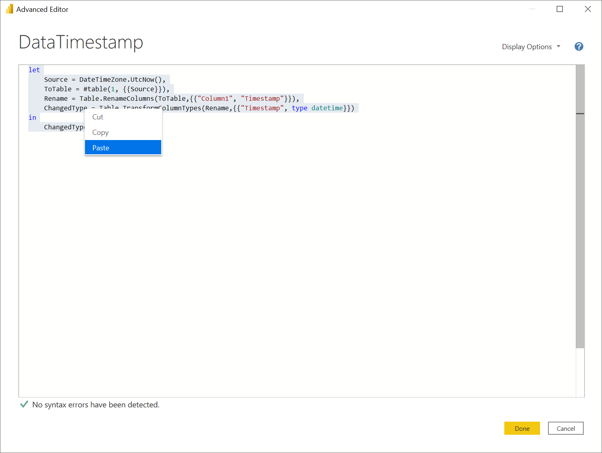

# Power BI Query Extract Utility

The Advanced Editor in Power BI Desktop ... leaves something to be desired in terms of editing M queries. This utility can extract the M queries from a running copy of Power BI Desktop to a local path. Then the `.m` files can be edited offline using Visual Studio Code and the [Power Query / M Language](https://marketplace.visualstudio.com/items?itemName=PowerQuery.vscode-powerquery) extension.

However, as far as I know, any changes made to the queries locally can't automatically be saved back to the Power BI model.  So you are stuck pasting changes back into the application manually.

I would love to be proved wrong on this, of course.

Inspired by the blog post [Using Visual Studio Code with Power BI](https://dax.tips/2020/07/09/using-visual-studio-code-with-power-bi/).